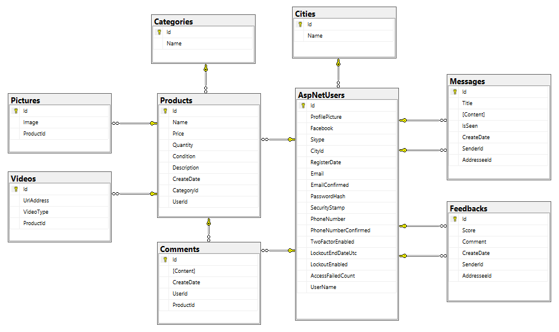
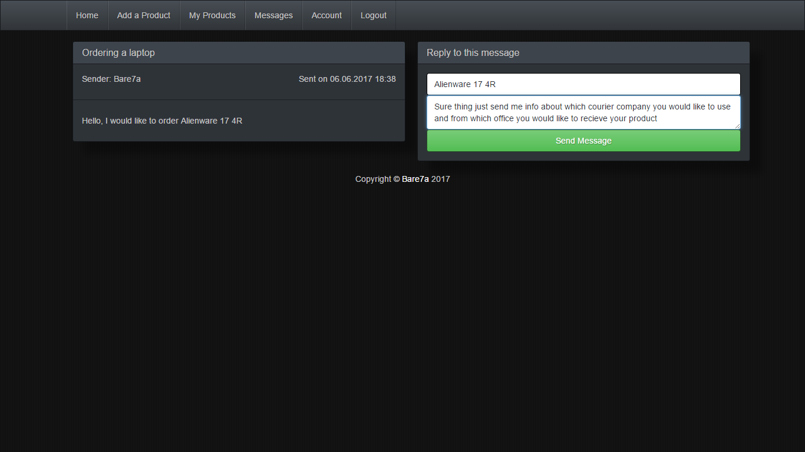
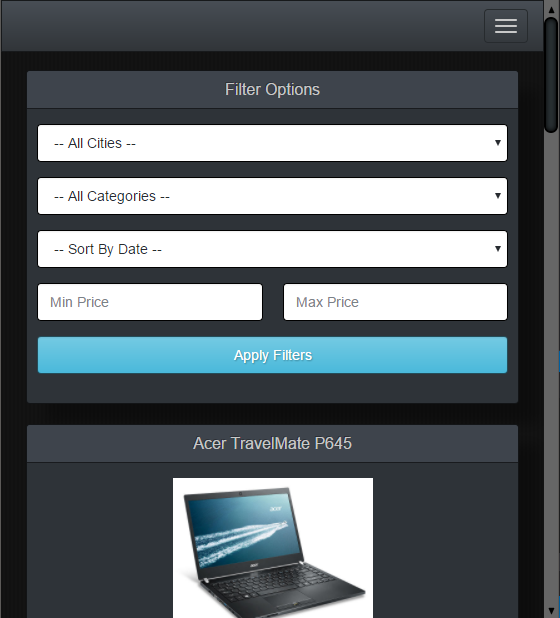
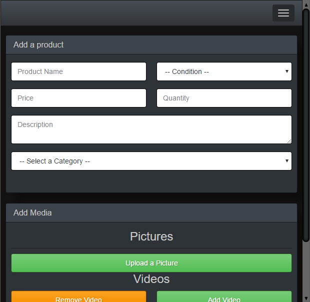
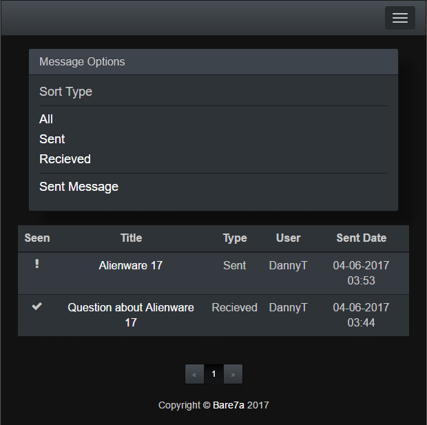
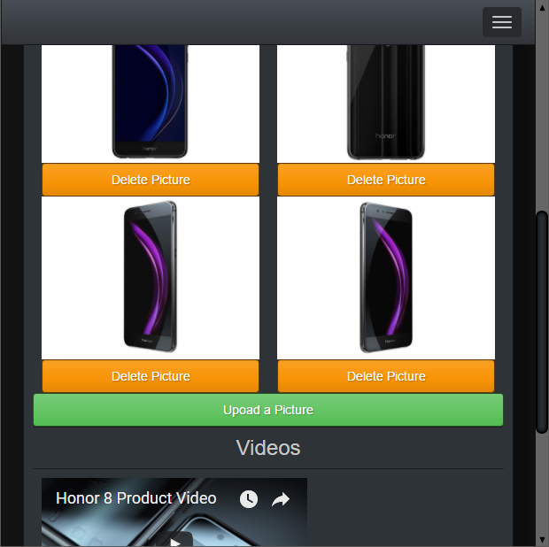

#Shop System - Web Application
## ShopSystem DataBase
- [x] [Database Tables]
  - [x] Categories
  - [x] Cities
  - [x] Users
  - [x] Products
  - [x] Pictures
  - [x] Videos
  - [x] Comments
  - [x] Feedbacks
  - [x] Messages

- [x] [Additional]
  - [x] Seed Methods
  - [x] Automatic Migrations

## ShopSystem REST Services
- [x] [Public Services]
  - [x] Get Published Products List
  - [x] Get Product Details
  - [x] Get All Categories
  - [x] Get All Cities
  - [x] Get All Product Comments
  - [x] Get All Product Pictures
  - [x] Get All Product Videos
  - [x] Get All User Feedbacks
  - [x] Get User Details
  - [x] User Login
  - [x] User Register
  
- [x] [User Services]
  - [x] Get Account Details
  - [x] Get Messages List
  - [x] Get Message Details
  - [x] Post new Product
  - [x] Post new product Comment
  - [x] Post new product Picture
  - [x] Post new product Video
  - [x] Post new Message
  - [x] Put Account
  - [x] Put Product
  - [x] Put product Comment
  - [x] Put product Picture
  - [x] Put product Video
  - [x] Put user Feedback
  - [x] Delete Product
  - [x] Delete product Comment
  - [x] Delete product Picture
  - [x] Delete Product Video
  - [x] Delete user Feedback
  - [x]	Authorization
  
- [x] [Additional]
  - [x] Binding Models for All Services
  - [x] View Models for All Services
  - [x] Error messages for All Services
  
## ShopSystem SPA Application
- [x] [Public Screens]
  - [x] Home Screen
  - [x] Login Screen
  - [x] Register Screen
  - [x] Products List
  - [x] Product Details
  - [x] User Details
  
- [x] [User Screens]

  - [x] Publish New Product
  - [x] List My Products
  - [x] Edit Product
  - [x]	Delete Product
  - [x] Edit Account Info
  - [x]	List all Messages
  - [x]	Read Message
  - [x]	Reply to Message
  - [x]	Sent a new Message
  - [x] Logout  
  - [x]	Authorization Checks

## ShopSystem Database Diagram

## ShopSystem Application Screenshots
- [x] [Login and Register]
  - [x] Register

  - [x] Register with Data

- [x] [Products]
  - [x] All Products

  - [x] Filtered Products

  - [x] Add a Product

  - [x] Add a Product with Data

  - [x] User Products

  - [x] Detailed info about the Product

  - [x] Edit a Product

- [x] [Messages]
  - [x] All Messages

  - [x] Reply to a Message

  - [x] Message after the reply

  - [x] Sent a new Message

- [x] [Profile]
  - [x] Edit Profile

  - [x] Submit a user Feedback

- [x] [Responsiveness]

 
 
 
 
 
 
 
  